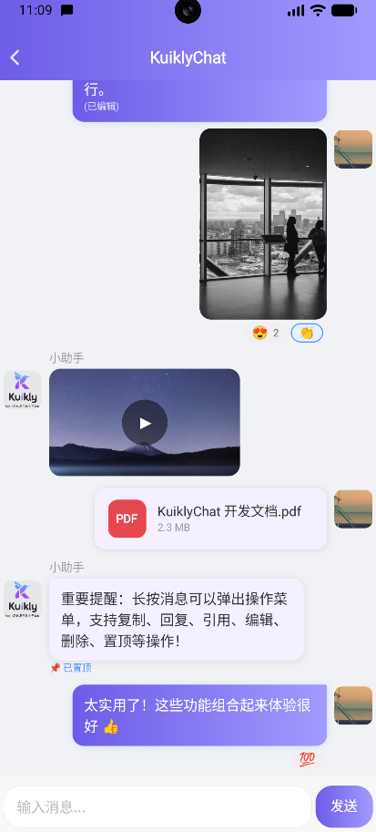
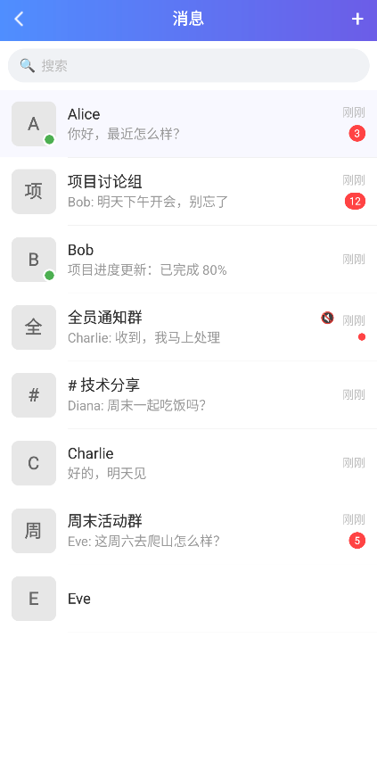
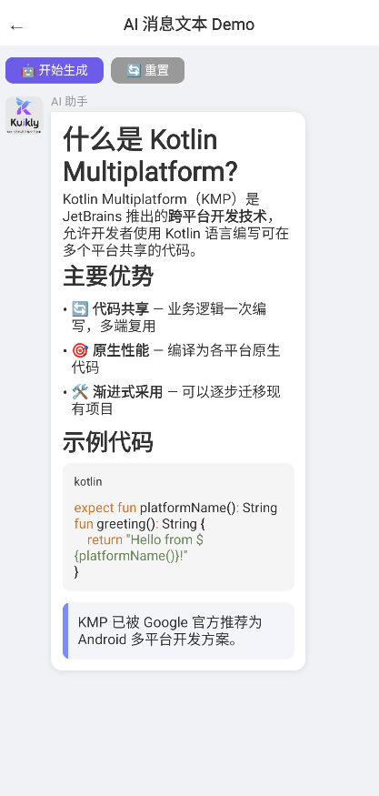

# KuiklyChat

基于 [KuiklyUI](https://github.com/Tencent-TDS/KuiklyUI) 跨端框架构建的聊天 UI 组件库，支持 Android、iOS、鸿蒙、H5 多端运行。

<div align="center">
  
</div>

## 接入指南

### 1. 添加 Maven 仓库

在 `settings.gradle.kts` 中添加仓库地址：

```kotlin
dependencyResolutionManagement {
    repositories {
        // ... 其他仓库
        maven {
            url = uri("https://mirrors.tencent.com/nexus/repository/maven-tencent/")
        }
    }
}
```

### 2. 添加依赖

在模块的 `build.gradle.kts` 中添加：

```kotlin
kotlin {
    sourceSets {
        val commonMain by getting {
            dependencies {
                // KuiklyChat 聊天组件
                implementation("com.tencent.kuiklybase:KuiklyChat:1.0.0-2.0.21")
            }
        }
    }
}
```

在 `build.ohos.gradle.kts` 中添加：

```kotlin
kotlin {
    sourceSets {
        val commonMain by getting {
            dependencies {
                // KuiklyChat 聊天组件
                implementation("com.tencent.kuiklybase:KuiklyChat:1.0.0-2.0.21-KBA-010")
            }
        }
    }
}
```

### 3. 导入包

```kotlin
import com.tencent.kuiklybase.chat.*
```

### 4. 最小化示例

```kotlin
@Page("chat")
class MyChatPage : BasePager() {

    var messageList by observableList<ChatMessage>()

    override fun body(): ViewBuilder {
        val ctx = this
        return {
            View {
                attr { flex(1f); flexDirection(FlexDirection.COLUMN) }

                ChatSession({ ctx.messageList }) {
                    title = "聊天"
                    showMessageComposer = true
                    composerSafeAreaBottom = ctx.pagerData.safeAreaInsets.bottom
                    onSendMessage = { text ->
                        ctx.messageList.add(
                            ChatMessageHelper.createTextMessage(
                                content = text,
                                isSelf = true,
                                senderName = "我"
                            )
                        )
                    }
                }
            }
        }
    }
}
```

---

## 核心 API

### ChatSession（核心入口）

聊天界面的顶层入口，是 `ViewContainer` 的扩展函数：

```kotlin
fun ViewContainer<*, *>.ChatSession(
    messageList: () -> ObservableList<ChatMessage>,
    config: ChatSessionConfig.() -> Unit
)
```

| 参数 | 类型 | 说明 |
|------|------|------|
| `messageList` | `() -> ObservableList<ChatMessage>` | 响应式消息列表的 Lambda 引用 |
| `config` | `ChatSessionConfig.() -> Unit` | DSL 配置块 |

`ChatSession` 内部自动包含：导航栏、消息列表（含背景图层）、可选的 MessageComposer 输入框。

---

### ChatSessionConfig（配置类）

所有配置通过 `ChatSession` 的尾部 Lambda 设置。支持 **DSL 分组** 和 **平铺** 两种风格。

#### 基础配置

| 属性 | 类型 | 默认值 | 说明 |
|------|------|--------|------|
| `title` | `String` | `"聊天"` | 导航栏标题 |
| `showNavigationBar` | `Boolean` | `true` | 是否显示导航栏 |
| `showBackButton` | `Boolean` | `true` | 是否显示返回按钮 |
| `selfAvatarUrl` | `String` | `""` | 自己的头像 URL |
| `messageActions` | `List<MessageAction>` | `defaultMessageActions()` | 长按消息的操作菜单项 |

#### 扩展机制配置

| 属性 | 类型 | 默认值 | 说明 |
|------|------|--------|------|
| `componentFactory` | `ChatComponentFactory` | `DefaultChatComponentFactory()` | 全局组件工厂，替换原子组件（头像、状态指示器、重发按钮等）的默认渲染 |
| `dateSeparatorHandler` | `DateSeparatorHandler` | `DefaultDateSeparatorHandler()` | 日期分隔符处理器，控制日期分隔逻辑和格式化 |
| `messagePositionHandler` | `MessagePositionHandler` | `DefaultMessagePositionHandler()` | 消息分组处理器，控制消息在分组中的位置（TOP/MIDDLE/BOTTOM/SINGLE） |
| `messageTextFormatter` | `MessageTextFormatter` | `DefaultMessageTextFormatter()` | 消息文本格式化器，自定义消息内容渲染（如 Markdown 解析、@提及高亮） |
| `messageRenderers` | `MutableList<MessageRendererFactory>` | `mutableListOf()` | 消息渲染器工厂列表，扩展自定义消息类型渲染 |

> **优先级链**：`Slot API` > `ComponentFactory` > `内置默认渲染`

#### MessageComposer 输入框配置

| 属性 | 类型 | 默认值 | 说明 |
|------|------|--------|------|
| `showMessageComposer` | `Boolean` | `false` | 是否显示内置输入框 |
| `composerPlaceholder` | `String` | `"输入消息..."` | 输入框提示文字 |
| `composerSendButtonText` | `String` | `"发送"` | 发送按钮文字 |
| `composerSafeAreaBottom` | `Float` | `0f` | 底部安全区域高度（需从外部传入 `pagerData.safeAreaInsets.bottom`） |

#### 事件回调

| 回调 | 类型 | 说明 |
|------|------|------|
| `onBackClick` | `(() -> Unit)?` | 返回按钮点击 |
| `onMessageClick` | `((ChatMessage) -> Unit)?` | 消息点击 |
| `onMessageLongPress` | `((ChatMessage) -> Unit)?` | 消息长按 |
| `onMessageLongPressWithPosition` | `((ChatMessage, Float, Float, Float, Float) -> Unit)?` | 带位置的消息长按 (msg, x, y, width, height) |
| `onResend` | `((ChatMessage) -> Unit)?` | 失败消息重发 |
| `onAvatarClick` | `((ChatMessage) -> Unit)?` | 头像点击 |
| `onSendMessage` | `((String) -> Unit)?` | 发送消息（内置 Composer 用） |
| `onInputValueChange` | `((String) -> Unit)?` | 输入文本变化 |
| `onAttachmentsClick` | `(() -> Unit)?` | 附件按钮点击 |
| `onReactionClick` | `((ChatMessage, String) -> Unit)?` | 反应点击 (消息, 反应类型) |
| `onEditMessage` | `((ChatMessage) -> Unit)?` | 消息编辑 |
| `onDeleteMessage` | `((ChatMessage) -> Unit)?` | 消息删除 |
| `onThreadClick` | `((ChatMessage) -> Unit)?` | 线程回复点击 |
| `onMessageAction` | `((ChatMessage, MessageAction) -> Unit)?` | 操作菜单项点击 |
| `onPinMessage` | `((ChatMessage) -> Unit)?` | 消息置顶 |

#### 暴露的滚动 API

ChatSession 内部初始化时自动设置，业务方通过 config 引用调用：

| API | 类型 | 说明 |
|-----|------|------|
| `scrollToBottomAction` | `((animate: Boolean) -> Unit)?` | 手动滚动到底部 |
| `scrollToMessageAction` | `((messageId: String, animate: Boolean) -> Unit)?` | 滚动到指定消息 |

```kotlin
// 使用方式：保存 config 引用
var chatConfig: ChatSessionConfig? = null

ChatSession({ ctx.messageList }) {
    ctx.chatConfig = this
}

// 后续使用
chatConfig?.scrollToBottomAction?.invoke(true)
chatConfig?.scrollToMessageAction?.invoke(targetMsgId, true)
```

#### DSL 分组配置方法

```kotlin
ChatSession({ ctx.messageList }) {
    // 主题配置
    theme { /* ChatThemeOptions */ }
    // 列表行为配置
    messageListOptions { /* MessageListOptions */ }
    // 渲染插槽配置
    slots { /* ChatSlotOptions */ }
}
```

---

### theme {} — 主题配置（ChatThemeOptions）

| 属性 | 类型 | 默认值 | 说明 |
|------|------|--------|------|
| `themeMode` | `ChatThemeMode` | `LIGHT` | 主题模式：`LIGHT` / `DARK` / `SYSTEM` |
| `primaryColor` | `Long` | `0xFF4F8FFF` | 主色（自己气泡渐变起始色、导航栏） |
| `primaryGradientEndColor` | `Long` | `0xFF6C5CE7` | 渐变结束色 |
| `backgroundColor` | `Long` | `0xFFF0F2F5` | 页面背景色 |
| `otherBubbleColor` | `Long` | `0xFFFFFFFF` | 对方气泡背景色 |
| `otherTextColor` | `Long` | `0xFF333333` | 对方文字颜色 |
| `selfTextColor` | `Long` | `0xFFFFFFFF` | 自己文字颜色 |
| `avatarRadius` | `Float` | `8f` | 头像圆角（20f=圆形, 8f=微信风格, 0f=方形） |
| `bubbleMaxWidthRatio` | `Float` | `0.65f` | 气泡最大宽度比例 |
| `bubblePaddingH` | `Float` | `12f` | 气泡水平内边距 |
| `bubblePaddingV` | `Float` | `10f` | 气泡垂直内边距 |
| `messageFontSize` | `Float` | `15f` | 消息文字大小 |
| `messageLineHeight` | `Float` | `22f` | 消息行高 |
| `avatarSize` | `Float` | `40f` | 头像尺寸 |
| `rowPaddingV` | `Float` | `6f` | 消息行垂直间距 |
| `rowPaddingH` | `Float` | `12f` | 消息行水平间距 |
| `avatarBubbleGap` | `Float` | `8f` | 头像与气泡间距 |
| `backgroundImage` | `String` | `""` | 聊天区域背景图 URL |
| `imageMaxWidth` | `Float` | `200f` | 图片消息最大宽度 |
| `imageMaxHeight` | `Float` | `200f` | 图片消息最大高度 |
| `imageRadius` | `Float` | `12f` | 图片消息圆角 |
| `composerBackgroundColor` | `Long` | `0xFFF8F8F8` | 输入栏背景色 |
| `composerBorderColor` | `Long` | `0xFFE0E0E0` | 输入栏边框色 |
| `composerInputBackgroundColor` | `Long` | `0xFFFFFFFF` | 输入框背景色 |
| `composerInputBorderColor` | `Long` | `0xFFE0E0E0` | 输入框边框色 |
| `composerInputTextColor` | `Long` | `0xFF333333` | 输入框文字色 |
| `composerPlaceholderColor` | `Long` | `0xFFBBBBBB` | 占位文字色 |
| `composerSendButtonTextColor` | `Long` | `0xFFFFFFFF` | 发送按钮文字色 |

**便捷方法：**

| 方法 | 说明 |
|------|------|
| `useDarkTheme()` | 切换到深色主题 |
| `useLightTheme()` | 切换到浅色主题 |
| `applyThemeColors(colors)` | 应用预定义颜色方案 |

> 所有 theme 属性均可在 Config 顶层直接设置（向后兼容），如 `primaryColor = 0xFF6C5CE7` 等价于 `theme { primaryColor = 0xFF6C5CE7 }`。

---

### messageListOptions {} — 列表行为配置（MessageListOptions）

| 属性 | 类型 | 默认值 | 说明 |
|------|------|--------|------|
| `autoScrollToBottom` | `Boolean` | `true` | 新消息自动滚动到底部 |
| `showAvatar` | `Boolean` | `true` | 是否显示头像 |
| `showSenderName` | `Boolean` | `true` | 是否显示昵称 |
| `showTimeGroup` | `Boolean` | `true` | 启用时间分组 |
| `timeGroupInterval` | `Long` | `300000`（5分钟） | 时间分组间隔（毫秒） |
| `timeFormatter` | `TimeFormatter?` | `null` | 自定义时间格式化器 |
| `enableMessageGrouping` | `Boolean` | `true` | 启用消息分组（合并头像、缩小间距） |
| `messageGroupingInterval` | `Long` | `120000`（2分钟） | 消息分组间隔阈值 |
| `typingUsers` | `List<String>` | `emptyList()` | 正在输入的用户列表（非空时显示指示器） |
| `onLoadEarlier` | `(() -> Unit)?` | `null` | 滚动到顶部时加载历史消息回调 |
| `isLoadingEarlier` | `Boolean` | `false` | 是否正在加载历史（由业务维护） |
| `hasMoreEarlier` | `Boolean` | `true` | 是否还有更多历史 |
| `loadEarlierThreshold` | `Float` | `100f` | 触发加载的距顶阈值（像素） |

**自动滚动策略：**

| 消息来源 | 策略 |
|----------|------|
| 自己发的消息（`isSelf = true`） | **始终**滚动到底部 |
| 他人的消息（`isSelf = false`） | 当前在底部才滚动，否则保持位置 |

**加载历史消息用法：**

```kotlin
messageListOptions {
    hasMoreEarlier = true
    onLoadEarlier = {
        // 1. 标记加载中
        chatConfig?.isLoadingEarlier = true
        // 2. 异步获取历史消息
        fetchHistory { historyMessages ->
            // 3. 插入到列表头部（组件自动处理位置补偿防跳动）
            messageList.addAll(0, historyMessages)
            // 4. 更新状态
            chatConfig?.isLoadingEarlier = false
            if (noMoreHistory) chatConfig?.hasMoreEarlier = false
        }
    }
}
```

---

### ChatMessage（消息模型）

```kotlin
data class ChatMessage(
    val id: String,                                    // 消息唯一 ID
    val content: String,                               // 消息内容（文本或图片 URL）
    val isSelf: Boolean,                               // 是否为自己发送
    val type: MessageType = MessageType.TEXT,           // 消息类型
    val status: MessageStatus = MessageStatus.SENT,    // 发送状态
    val senderName: String = "",                       // 发送者名称
    val senderAvatar: String = "",                     // 发送者头像 URL
    val timestamp: Long = 0L,                          // 时间戳（毫秒）
    val extra: Map<String, String> = emptyMap(),       // 扩展数据
    val senderId: String = "",                         // 发送者唯一 ID
    val reactions: List<ReactionItem> = emptyList(),   // 消息反应列表
    val threadCount: Int = 0,                          // 线程回复数量
    val isEdited: Boolean = false,                     // 是否已编辑
    val isDeleted: Boolean = false,                    // 是否已删除（软删除）
    val isPinned: Boolean = false,                     // 是否置顶
    val readBy: List<String> = emptyList(),            // 已读用户 ID 列表
    val attachments: List<Attachment> = emptyList()    // 附件列表
)
```

#### MessageType — 消息类型

| 值 | 说明 |
|----|------|
| `TEXT` | 文本消息 |
| `IMAGE` | 图片消息（内置渲染：自动缩放+圆角） |
| `VIDEO` | 视频消息 |
| `FILE` | 文件消息 |
| `SYSTEM` | 系统消息（时间提示、通知等） |
| `CUSTOM` | 自定义消息（需通过 Slot 或 Factory 渲染） |

#### MessageStatus — 发送状态

| 值 | 说明 |
|----|------|
| `SENDING` | 发送中（显示"发送中..."） |
| `SENT` | 已发送（不显示状态） |
| `FAILED` | 发送失败（显示"发送失败，点击重试" + 红色重发按钮） |
| `READ` | 已读（显示"已读"） |

#### ReactionItem — 消息反应

```kotlin
data class ReactionItem(
    val type: String,                  // 反应类型（如 "👍"、"❤️"）
    val count: Int = 1,                // 反应数量
    val isOwnReaction: Boolean = false // 当前用户是否已添加（高亮显示）
)
```

#### Attachment — 附件

```kotlin
data class Attachment(
    val type: AttachmentType,          // IMAGE / VIDEO / FILE / GIPHY / LINK_PREVIEW
    val url: String,                   // 资源 URL
    val title: String = "",            // 标题
    val mimeType: String = "",         // MIME 类型
    val fileSize: Long = 0L,           // 文件大小（字节）
    val width: Int = 0,                // 宽度
    val height: Int = 0,               // 高度
    val duration: Float = 0f,          // 时长（秒）
    val thumbnailUrl: String = "",     // 缩略图 URL
    val extra: Map<String, String> = emptyMap()
)
```

#### MessageAction — 操作菜单项

```kotlin
data class MessageAction(
    val key: String,                              // 操作标识（copy/reply/edit/delete/pin 等）
    val label: String,                            // 显示文本
    val icon: String = "",                        // 图标（base64 或 URL）
    val isDestructive: Boolean = false,           // 是否为危险操作（红色显示）
    val isVisible: (ChatMessage) -> Boolean = { true } // 动态可见性
)
```

#### MessageContext — 消息上下文

Slot 和 Factory 渲染时提供的上下文信息，用于实现连续消息合并头像等效果：

```kotlin
data class MessageContext(
    val message: ChatMessage,           // 当前消息
    val previousMessage: ChatMessage?,  // 上一条消息
    val nextMessage: ChatMessage?,      // 下一条消息
    val index: Int = 0,                 // 索引
    val isFirstInGroup: Boolean = true, // 是否为分组第一条（显示发送者名称）
    val isLastInGroup: Boolean = true   // 是否为分组最后一条（显示头像）
)
```

---

### ChatMessageHelper（工具类）

提供快捷创建消息的静态方法：

```kotlin
// 创建文本消息
ChatMessageHelper.createTextMessage(
    content = "Hello!",
    isSelf = true,
    senderName = "我",
    senderId = "user_001",
    senderAvatar = "https://example.com/avatar.png",
    status = MessageStatus.SENT,
    timestamp = 1711267200000L,
    reactions = listOf(ReactionItem("👍", 1))
)

// 创建图片消息
ChatMessageHelper.createImageMessage(
    imageUrl = "https://example.com/photo.jpg",
    isSelf = false,
    senderName = "小助手",
    width = 600, height = 400,
    timestamp = 1711267200000L
)

// 创建视频消息
ChatMessageHelper.createVideoMessage(
    videoUrl = "https://example.com/video.mp4",
    isSelf = true,
    thumbnailUrl = "https://example.com/thumb.jpg",
    width = 1920, height = 1080, duration = 120f
)

// 创建文件消息
ChatMessageHelper.createFileMessage(
    fileUrl = "https://example.com/doc.pdf",
    fileName = "项目文档.pdf",
    isSelf = false,
    mimeType = "application/pdf",
    fileSize = 1024 * 1024
)

// 创建系统消息
ChatMessageHelper.createSystemMessage("以下是新的聊天", timestamp = 1711267200000L)

// 创建自定义消息
ChatMessageHelper.createCustomMessage(
    content = "location",
    isSelf = true,
    extra = mapOf("lat" to "39.9", "lng" to "116.4")
)

// 生成唯一消息 ID
val id = ChatMessageHelper.generateId()  // "msg_1_1711267200000"

// 构建消息上下文（计算分组信息）
val ctx = ChatMessageHelper.buildMessageContext(messages, index, groupingInterval = 120000L)
```

---

### MessageRendererFactory（渲染工厂）

注册制的消息渲染扩展机制，用于扩展自定义消息类型渲染：

```kotlin
interface MessageRendererFactory {
    fun canRender(message: ChatMessage): Boolean
    fun render(container: ViewContainer<*, *>, context: MessageContext, config: ChatSessionConfig)
}
```

**渲染优先级链**：`messageBubble Slot` > `类型独立 Slot` > `MessageRendererFactory` > `默认内置渲染`

**内置渲染器**（通过 `defaultMessageRenderers()` 获取）：

| 渲染器 | 匹配类型 |
|--------|----------|
| `TextMessageRenderer` | `MessageType.TEXT` |
| `ImageMessageRenderer` | `MessageType.IMAGE` |
| `SystemMessageRenderer` | `MessageType.SYSTEM` |
| `VideoMessageRenderer` | `MessageType.VIDEO` |
| `FileMessageRenderer` | `MessageType.FILE` |

**自定义渲染器示例**：

```kotlin
class LocationMessageRenderer : MessageRendererFactory {
    override fun canRender(message: ChatMessage): Boolean {
        return message.type == MessageType.CUSTOM && message.extra["subType"] == "location"
    }
    override fun render(container: ViewContainer<*, *>, context: MessageContext, config: ChatSessionConfig) {
        container.View {
            // 自定义地图卡片渲染
        }
    }
}

// 注册
ChatSession({ ctx.messageList }) {
    messageRenderers.add(LocationMessageRenderer())
}
```

---

### ChatComponentFactory（组件工厂）

全局可替换的原子组件渲染机制。通过实现 `ChatComponentFactory` 接口，用户可以自定义任何原子组件的渲染方式，而无需为每个使用场景都设置 Slot。

**优先级链**：`Slot API` > `ChatComponentFactory` > `内置默认渲染`

**接口定义**：

```kotlin
interface ChatComponentFactory {
    fun renderAvatar(container, avatarUrl, size, radius, placeholderColor, onClick)
    fun renderAvatarPlaceholder(container, size)
    fun renderSenderName(container, name, color, fontSize)
    fun renderMessageStatus(container, status, textColor, errorColor)
    fun renderResendButton(container, errorColor, onClick)
    fun renderUnreadBadge(container, count, bgColor, textColor, fontSize)
    fun renderOnlineIndicator(container, isOnline, color)
    fun renderPinnedIndicator(container, color)
    fun renderEditedLabel(container, color)
    fun renderThreadReplyIndicator(container, threadCount, color, onClick)
    fun renderFileIcon(container, mimeType, primaryColor)
}
```

**默认实现**：`DefaultChatComponentFactory` 提供所有原子组件的默认渲染方式，用户可继承此类并只覆盖需要自定义的方法。

**可替换组件列表**：

| 方法 | 说明 | 适用范围 |
|------|------|---------|
| `renderAvatar` | 用户头像渲染 | ChatSession + ChatChannelList |
| `renderAvatarPlaceholder` | 分组内头像占位 | ChatSession |
| `renderSenderName` | 发送者名称 | ChatSession |
| `renderMessageStatus` | 消息状态指示器（发送中/已读/失败） | ChatSession |
| `renderResendButton` | 重发按钮 | ChatSession |
| `renderUnreadBadge` | 未读计数徽章 | ChatChannelList |
| `renderOnlineIndicator` | 在线状态指示器 | ChatChannelList |
| `renderPinnedIndicator` | 置顶标记 | ChatSession |
| `renderEditedLabel` | 已编辑标记 | ChatSession |
| `renderThreadReplyIndicator` | 线程回复入口 | ChatSession |
| `renderFileIcon` | 文件消息图标 | ChatSession |

**自定义示例**：

```kotlin
ChatSession({ ctx.messageList }) {
    componentFactory = object : DefaultChatComponentFactory() {
        override fun renderAvatar(
            container: ViewContainer<*, *>,
            avatarUrl: String,
            size: Float,
            radius: Float,
            placeholderColor: Long,
            onClick: (() -> Unit)?
        ) {
            // 自定义头像：使用圆角方形 + 渐变占位
            container.apply {
                View {
                    attr {
                        size(size, size)
                        borderRadius(12f)
                        backgroundColor(Color(0xFF6C5CE7))
                        allCenter()
                    }
                    if (avatarUrl.isNotEmpty()) {
                        Image {
                            attr { size(size, size); borderRadius(12f); src(avatarUrl); resizeCover() }
                        }
                    } else {
                        Text {
                            attr { text(avatarUrl.take(1)); fontSize(18f); color(Color.WHITE) }
                        }
                    }
                }
            }
        }

        override fun renderMessageStatus(
            container: ViewContainer<*, *>,
            status: MessageStatus,
            textColor: Long,
            errorColor: Long
        ) {
            // 自定义消息状态：只显示失败状态
            if (status == MessageStatus.FAILED) {
                super.renderMessageStatus(container, status, textColor, errorColor)
            }
        }
    }
}
```

ChatChannelList 中同样支持 componentFactory：

```kotlin
ChatChannelList({ ctx.channelList }) {
    componentFactory = object : DefaultChatComponentFactory() {
        override fun renderUnreadBadge(
            container: ViewContainer<*, *>,
            count: Int,
            bgColor: Long,
            textColor: Long,
            fontSize: Float
        ) {
            // 自定义未读徽章样式
        }
    }
}
```

---

### Handler / Formatter（可替换处理器）

将格式化、处理逻辑抽象为接口，允许用户替换核心行为策略。

**ChatSession 中的 Handler/Formatter**：

| 接口 | 说明 | 默认实现 |
|------|------|---------|
| `DateSeparatorHandler` | 日期分隔符处理器：决定两条消息间是否插入分隔符 + 格式化日期文本 | `DefaultDateSeparatorHandler` |
| `MessagePositionHandler` | 消息分组处理器：计算消息在分组中的位置（SINGLE/TOP/MIDDLE/BOTTOM） | `DefaultMessagePositionHandler` |
| `MessageTextFormatter` | 消息文本格式化器：自定义消息内容渲染（如 Markdown 解析、@提及高亮） | `DefaultMessageTextFormatter` |

**ChatChannelList 中的 Formatter**：

| 接口 | 说明 | 默认实现 |
|------|------|---------|
| `ChannelNameFormatter` | 频道名称格式化器 | `DefaultChannelNameFormatter` |
| `MessagePreviewFormatter` | 消息预览文本格式化器 | `DefaultMessagePreviewFormatter` |
| `TimestampFormatter` | 时间戳格式化器 | `DefaultTimestampFormatter` |

**DateSeparatorHandler 接口**：

```kotlin
interface DateSeparatorHandler {
    fun shouldAddDateSeparator(previousTimestamp: Long, currentTimestamp: Long, interval: Long): Boolean
    fun formatDate(timestamp: Long): String
}
```

**MessagePositionHandler 接口**：

```kotlin
enum class MessagePosition { SINGLE, TOP, MIDDLE, BOTTOM }

interface MessagePositionHandler {
    fun handleMessagePosition(
        previousMessage: ChatMessage?,
        currentMessage: ChatMessage,
        nextMessage: ChatMessage?,
        groupingInterval: Long
    ): MessagePosition
}
```

**自定义示例**：

```kotlin
ChatSession({ ctx.messageList }) {
    // 自定义日期分隔：使用更紧凑的时间间隔
    dateSeparatorHandler = object : DateSeparatorHandler {
        override fun shouldAddDateSeparator(prev: Long, current: Long, interval: Long): Boolean {
            if (current <= 0L) return false
            if (prev <= 0L) return true
            // 不同天的消息一定加分隔符
            return !isSameDay(prev, current) || (current - prev) >= interval
        }
        override fun formatDate(timestamp: Long): String {
            return formatRelativeTime(timestamp)  // "刚刚"、"5分钟前"、"昨天 14:30" 等
        }
    }

    // 自定义消息分组：更宽松的分组策略
    messagePositionHandler = object : MessagePositionHandler {
        override fun handleMessagePosition(
            prev: ChatMessage?, current: ChatMessage, next: ChatMessage?, interval: Long
        ): MessagePosition {
            // 群聊中同一个人 5 分钟内的消息归为一组
            // 1v1 聊天中不分组
            if (current.type == MessageType.SYSTEM) return MessagePosition.SINGLE
            val samePrev = prev != null && prev.senderId == current.senderId
                && current.isSelf == prev.isSelf
                && (current.timestamp - prev.timestamp) < interval
            val sameNext = next != null && next.senderId == current.senderId
                && current.isSelf == next.isSelf
                && (next.timestamp - current.timestamp) < interval
            return when {
                !samePrev && !sameNext -> MessagePosition.SINGLE
                !samePrev -> MessagePosition.TOP
                !sameNext -> MessagePosition.BOTTOM
                else -> MessagePosition.MIDDLE
            }
        }
    }

    // 自定义消息文本格式化：Markdown 解析
    messageTextFormatter = MessageTextFormatter { message ->
        parseMarkdown(message.content)  // **粗体** → 粗体, *斜体* → 斜体
    }
}
```

频道列表 Formatter 示例：

```kotlin
ChatChannelList({ ctx.channelList }) {
    // 自定义频道名称
    channelNameFormatter = ChannelNameFormatter { channel ->
        when (channel.type) {
            ChannelType.GROUP -> "群聊: ${channel.name}"
            ChannelType.DIRECT -> channel.name
            ChannelType.CHANNEL -> "# ${channel.name}"
        }
    }

    // 自定义消息预览
    messagePreviewFormatter = MessagePreviewFormatter { channel, maxLength ->
        val msg = channel.lastMessage ?: return@MessagePreviewFormatter "暂无消息"
        val prefix = if (msg.isSelf) "你: " else "${msg.senderName}: "
        val text = prefix + when (msg.type) {
            MessageType.IMAGE -> "[图片]"
            MessageType.FILE -> "[文件] ${msg.content}"
            else -> msg.content
        }
        if (text.length > maxLength) text.take(maxLength) + "..." else text
    }

    // 自定义时间格式
    timestampFormatter = TimestampFormatter { timestamp ->
        formatRelativeTimestamp(timestamp)  // "刚刚"、"2小时前"、"昨天" 等
    }
}
```

---

### ChatRepository（数据仓库接口）

定义聊天组件所需的所有数据操作接口，使组件库**不绑定任何具体后端**。

> Stream Chat 的最大问题是强绑定自己的 ChatClient 后端。KuiklyChat 通过接口抽象解耦，业务方可接入任何数据源。

**接口定义**：

```kotlin
interface ChatRepository {
    // 频道操作
    suspend fun getChannels(limit: Int = 20, offset: Int = 0): ChatChannelsResponse
    suspend fun getChannel(channelId: String): ChatChannel?

    // 消息操作
    suspend fun getMessages(channelId: String, limit: Int = 30, before: String? = null): ChatMessagesResponse
    suspend fun sendMessage(channelId: String, message: ChatMessage): ChatMessage
    suspend fun editMessage(messageId: String, newContent: String): ChatMessage
    suspend fun deleteMessage(messageId: String): Boolean

    // 反应操作
    suspend fun toggleReaction(messageId: String, reactionType: String): ChatMessage

    // 置顶操作
    suspend fun pinMessage(messageId: String, pinned: Boolean): ChatMessage

    // 输入状态
    suspend fun sendTypingEvent(channelId: String)
    suspend fun getTypingUsers(channelId: String): List<String>

    // 频道状态
    suspend fun markChannelRead(channelId: String)
    suspend fun muteChannel(channelId: String, muted: Boolean)
    suspend fun pinChannel(channelId: String, pinned: Boolean)
    suspend fun deleteChannel(channelId: String): Boolean
}
```

**响应封装**：

```kotlin
data class ChatMessagesResponse(val messages: List<ChatMessage>, val hasMore: Boolean = true)
data class ChatChannelsResponse(val channels: List<ChatChannel>, val hasMore: Boolean = true)
```

**使用示例**：

```kotlin
// 实现自定义数据源
class FirebaseChatRepository : ChatRepository {
    override suspend fun getChannels(limit: Int, offset: Int): ChatChannelsResponse {
        val snapshot = FirebaseFirestore.getInstance()
            .collection("channels")
            .orderBy("lastMessageAt", Query.Direction.DESCENDING)
            .startAfter(offset)
            .limit(limit.toLong())
            .get()
            .await()
        return ChatChannelsResponse(
            channels = snapshot.documents.map { it.toChatChannel() },
            hasMore = snapshot.size() == limit
        )
    }
    // ... 实现其他方法
}

// 在业务中使用
val repository: ChatRepository = FirebaseChatRepository()
val channels = repository.getChannels(limit = 20)
```

---

### ChatChannel（频道/会话模型）

代表一个聊天频道或会话，用于频道列表展示。

**ChatChannel 字段**：

| 字段 | 类型 | 默认值 | 说明 |
|------|------|--------|------|
| `id` | `String` | — | 频道唯一 ID |
| `type` | `ChannelType` | `DIRECT` | 频道类型 |
| `name` | `String` | `""` | 频道名称（群聊名/频道名；单聊时为对方昵称） |
| `avatarUrl` | `String` | `""` | 频道头像 URL |
| `lastMessage` | `ChatMessage?` | `null` | 最后一条消息（用于列表预览） |
| `lastMessageAt` | `Long` | `0L` | 最后消息时间戳（毫秒，用于排序） |
| `unreadCount` | `Int` | `0` | 未读消息数 |
| `isMuted` | `Boolean` | `false` | 是否已静音 |
| `isPinned` | `Boolean` | `false` | 是否已置顶 |
| `memberCount` | `Int` | `0` | 成员总数 |
| `members` | `List<ChatChannelMember>` | `emptyList()` | 成员列表（可选，按需加载） |
| `createdAt` | `Long` | `0L` | 频道创建时间戳（毫秒） |
| `updatedAt` | `Long` | `0L` | 频道更新时间戳（毫秒） |
| `extra` | `Map<String, String>` | `emptyMap()` | 扩展数据（业务方自定义字段） |

**ChannelType 枚举**：

| 值 | 说明 |
|----|------|
| `DIRECT` | 单聊（1v1） |
| `GROUP` | 群聊 |
| `CHANNEL` | 公开频道（类似 Discord/Slack） |
| `CUSTOM` | 自定义类型 |

**ChatChannelMember 字段**：

| 字段 | 类型 | 默认值 | 说明 |
|------|------|--------|------|
| `id` | `String` | — | 成员唯一 ID |
| `name` | `String` | — | 成员显示名称 |
| `avatarUrl` | `String` | `""` | 成员头像 URL |
| `role` | `MemberRole` | `MEMBER` | 成员角色（`OWNER` / `ADMIN` / `MEMBER` / `GUEST`） |
| `onlineStatus` | `OnlineStatus` | `OFFLINE` | 在线状态（`ONLINE` / `OFFLINE` / `BUSY` / `AWAY`） |
| `lastActiveAt` | `Long` | `0L` | 最后活跃时间戳（毫秒） |
| `extra` | `Map<String, String>` | `emptyMap()` | 扩展数据 |

**ChatChannelHelper 工具类**：

| 方法 | 说明 |
|------|------|
| `generateId()` | 生成频道唯一 ID |
| `createDirectChannel(...)` | 创建单聊频道 |
| `createGroupChannel(...)` | 创建群聊频道 |
| `createPublicChannel(...)` | 创建公开频道 |
| `getLastMessagePreview(channel, maxLength)` | 获取频道最后消息的预览文本 |
| `formatLastMessageTime(timestamp)` | 格式化频道最后消息时间 |

---

### ChatChannelList（频道列表组件）

频道/会话列表组件，展示用户的所有聊天频道，支持搜索、未读计数、在线状态等。

<div align="center">
  
</div>

**函数签名**：

```kotlin
fun ViewContainer<*, *>.ChatChannelList(
    channelList: () -> ObservableList<ChatChannel>,
    config: ChatChannelListConfig.() -> Unit
)
```

**基本用法**：

```kotlin
var channelList by observableList<ChatChannel>()

ChatChannelList({ ctx.channelList }) {
    title = "消息"
    showHeader = true
    showSearchBar = true

    // 主题配置
    theme {
        primaryColor = 0xFF4F8FFF
        channelNameColor = 0xFF333333
        unreadBadgeColor = 0xFFFF4444
    }

    // 事件回调
    onChannelClick = { channel -> /* 进入聊天 */ }
    onChannelLongPress = { channel -> /* 长按操作 */ }
    onSearchTextChange = { text -> /* 搜索 */ }
    onLoadMore = { /* 加载更多频道 */ }
}
```

**ChatChannelListConfig 配置项**：

| 属性 | 类型 | 默认值 | 说明 |
|------|------|--------|------|
| `title` | `String` | `"消息"` | 导航栏标题 |
| `showHeader` | `Boolean` | `true` | 是否显示导航栏 |
| `showSearchBar` | `Boolean` | `true` | 是否显示搜索栏 |
| `searchPlaceholder` | `String` | `"搜索"` | 搜索栏占位文字 |
| `showOnlineIndicator` | `Boolean` | `true` | 是否显示在线状态指示器 |
| `showUnreadCount` | `Boolean` | `true` | 是否显示未读计数 |
| `showLastMessage` | `Boolean` | `true` | 是否显示最后消息预览 |
| `showLastMessageTime` | `Boolean` | `true` | 是否显示最后消息时间 |
| `hasMore` | `Boolean` | `true` | 是否还有更多频道可加载 |
| `isLoadingMore` | `Boolean` | `false` | 是否正在加载更多 |
| `componentFactory` | `ChatComponentFactory` | `DefaultChatComponentFactory()` | 组件工厂 |
| `channelNameFormatter` | `ChannelNameFormatter` | `DefaultChannelNameFormatter()` | 频道名称格式化器 |
| `messagePreviewFormatter` | `MessagePreviewFormatter` | `DefaultMessagePreviewFormatter()` | 消息预览文本格式化器 |
| `timestampFormatter` | `TimestampFormatter` | `DefaultTimestampFormatter()` | 时间戳格式化器 |

**事件回调**：

| 回调 | 类型 | 说明 |
|------|------|------|
| `onChannelClick` | `(ChatChannel) -> Unit` | 频道点击 |
| `onChannelLongPress` | `(ChatChannel) -> Unit` | 频道长按 |
| `onChannelDelete` | `(ChatChannel) -> Unit` | 频道删除（左滑删除） |
| `onChannelPin` | `(ChatChannel) -> Unit` | 频道置顶/取消置顶 |
| `onChannelMute` | `(ChatChannel) -> Unit` | 频道静音/取消静音 |
| `onSearchTextChange` | `(String) -> Unit` | 搜索文本变化 |
| `onBackClick` | `() -> Unit` | 返回按钮点击 |
| `onTrailingClick` | `() -> Unit` | 右上角操作按钮点击 |
| `onLoadMore` | `() -> Unit` | 滚动到底部触发加载更多 |

**Slot 插槽**：

通过 `slots {}` DSL 配置自定义渲染：

```kotlin
ChatChannelList({ ctx.channelList }) {
    slots {
        // 自定义频道项渲染
        channelItem = { container, channel, config ->
            container.View { /* 自定义频道项 UI */ }
        }
        // 自定义头部
        header = { container, config ->
            container.View { /* 自定义导航栏 + 搜索栏 */ }
        }
        // 空状态
        emptyContent = { container ->
            container.View { /* 自定义空状态 */ }
        }
        // 加载中
        loadingContent = { container ->
            container.View { /* 自定义加载中 */ }
        }
        // 自定义分隔线
        divider = { container, index ->
            container.View { /* 自定义分隔线 */ }
        }
    }
}
```

**ChannelListTheme 主题配置**：

| 属性 | 类型 | 默认值 | 说明 |
|------|------|--------|------|
| `backgroundColor` | `Long` | `0xFFFFFFFF` | 页面背景色 |
| `primaryColor` | `Long` | `0xFF4F8FFF` | 主色（导航栏、高亮） |
| `primaryGradientEndColor` | `Long` | `0xFF6C5CE7` | 渐变结束色 |
| `itemBackgroundColor` | `Long` | `0xFFFFFFFF` | 频道项背景色 |
| `channelNameColor` | `Long` | `0xFF333333` | 频道名称文字颜色 |
| `lastMessageColor` | `Long` | `0xFF999999` | 最后消息预览文字颜色 |
| `timeColor` | `Long` | `0xFFBBBBBB` | 时间文字颜色 |
| `unreadBadgeColor` | `Long` | `0xFFFF4444` | 未读计数背景色 |
| `dividerColor` | `Long` | `0xFFF0F0F0` | 分隔线颜色 |
| `avatarPlaceholderColor` | `Long` | `0xFFE8E8E8` | 头像占位背景色 |
| `onlineIndicatorColor` | `Long` | `0xFF4CAF50` | 在线状态指示器颜色 |
| `itemHeight` | `Float` | `72f` | 频道项高度 |
| `avatarSize` | `Float` | `48f` | 头像尺寸 |
| `avatarRadius` | `Float` | `8f` | 头像圆角 |
| `channelNameFontSize` | `Float` | `16f` | 频道名称字号 |
| `lastMessageFontSize` | `Float` | `14f` | 最后消息预览字号 |

---

### ChatPreviewData（预览 / Mock 数据）

提供用于 Preview、测试和 Demo 的 Mock 数据集合，附带一个开箱即用的 `MockChatRepository` 实现。

**预览数据**：

| API | 返回类型 | 说明 |
|-----|---------|------|
| `ChatPreviewData.currentUser` | `ChatChannelMember` | 当前用户（自己） |
| `ChatPreviewData.users` | `List<ChatChannelMember>` | 5 个预览用户 |
| `ChatPreviewData.messages(count, channelType)` | `List<ChatMessage>` | 生成指定数量的消息 |
| `ChatPreviewData.mixedMessages()` | `List<ChatMessage>` | 包含文本/图片/文件/系统消息的混合列表 |
| `ChatPreviewData.channels()` | `List<ChatChannel>` | 6 个预览频道（单聊/群聊/频道） |

**MockChatRepository**：

基于 `ChatPreviewData` 的 `ChatRepository` 实现，所有数据操作在内存中完成，适合 Demo 和测试：

```kotlin
val repository: ChatRepository = MockChatRepository()

// 获取频道列表
val channels = repository.getChannels(limit = 20)

// 获取消息
val messages = repository.getMessages("ch_1", limit = 30)

// 发送消息
val sent = repository.sendMessage("ch_1", ChatMessageHelper.createTextMessage("Hello"))

// 切换反应
val updated = repository.toggleReaction("msg_1", "👍")
```

---

## 主题系统

### 内置双主题

组件内置 `LightThemeColors` 和 `DarkThemeColors` 两套配色方案：

```kotlin
ChatSession({ ctx.messageList }) {
    theme {
        // 使用深色主题
        useDarkTheme()

        // 或设置主题模式
        themeMode = ChatThemeMode.DARK
    }
}
```

### 自定义主题颜色

```kotlin
theme {
    primaryColor = 0xFF6C5CE7
    primaryGradientEndColor = 0xFFA29BFE
    backgroundColor = 0xFFF0F2F5
    otherBubbleColor = 0xFFF5F0FF
    otherTextColor = 0xFF2D3436
    selfTextColor = 0xFFFFFFFF
}
```

### ChatThemeColors 数据类

包含 30+ 个颜色属性，覆盖所有 UI 元素：

```kotlin
val customColors = ChatThemeColors(
    primaryColor = 0xFF6C5CE7,
    backgroundColor = 0xFF1A1A2E,
    otherBubbleColor = 0xFF2D2D44,
    // ... 更多颜色配置
)

theme {
    applyThemeColors(customColors)
}
```

---

## Slot 插槽系统

Slot 是高级定制能力，允许替换组件的某个部分的渲染。通过 `slots {}` DSL 配置。

### 消息渲染 Slot

| Slot | 类型 | 说明 |
|------|------|------|
| `messageBubble` | `MessageBubbleSlot` | 替换**所有非系统消息**渲染（优先级最高） |
| `textBubble` | `MessageBubbleSlot` | 替换**文本消息**渲染 |
| `imageBubble` | `MessageBubbleSlot` | 替换**图片消息**渲染 |
| `customBubble` | `MessageBubbleSlot` | 替换**自定义消息**渲染 |
| `systemMessage` | `SimpleBubbleSlot` | 替换系统消息渲染 |

**Slot 类型签名：**

```kotlin
typealias MessageBubbleSlot = (container: ViewContainer<*, *>, context: MessageContext, config: ChatSessionConfig) -> Unit
typealias SimpleBubbleSlot = (container: ViewContainer<*, *>, message: ChatMessage, config: ChatSessionConfig) -> Unit
```

### 列表状态 Slot

| Slot | 类型 | 说明 |
|------|------|------|
| `emptyContent` | `ViewSlot` | 空列表占位 |
| `loadingContent` | `ViewSlot` | 首次加载指示器 |
| `loadingMoreContent` | `ViewSlot` | 顶部加载更多指示器 |
| `helperContent` | `ViewSlot` | 辅助内容（如"滚动到底部"按钮） |
| `dateSeparator` | `DateSeparatorSlot` | 日期分隔符 |
| `typingIndicator` | `TypingIndicatorSlot` | 输入指示器 |
| `reactionBar` | `ReactionBarSlot` | 反应栏 |
| `messageOptions` | `MessageOptionsSlot` | 操作菜单 |

### 导航栏 Slot

| Slot | 类型 | 说明 |
|------|------|------|
| `navigationBar` | `NavigationBarSlot` | 替换整个导航栏 |
| `navigationBarTrailing` | `ViewSlot` | 导航栏右侧区域 |

### MessageComposer Slot

| Slot | 类型 | 说明 |
|------|------|------|
| `messageComposer` | `MessageComposerSlot` | 完全替换输入框（设置后其他 Slot 失效） |
| `composerIntegrations` | `ComposerIntegrationsSlot` | 输入框左侧按钮区域 |
| `composerInput` | `ComposerInputSlot` | 核心输入区域 |
| `composerTrailing` | `ComposerTrailingSlot` | 输入框右侧（默认发送按钮） |
| `composerHeader` | `ComposerHeaderSlot` | 输入框顶部（回复/编辑提示） |
| `composerFooter` | `ComposerFooterSlot` | 输入框底部（工具栏） |

**MessageComposer 架构：**

```
┌──────────────────────────────────────────┐
│  composerHeader  (回复/编辑提示条)         │
├──────────────────────────────────────────┤
│        │                      │          │
│integra-│   composerInput      │ trailing  │
│ tions  │   (核心输入框)        │ (发送按钮) │
│(附件等) │                      │          │
├──────────────────────────────────────────┤
│  composerFooter  (工具栏/表情面板入口)      │
├──────────────────────────────────────────┤
│  safeArea  (底部安全区域)                  │
└──────────────────────────────────────────┘
```

---

## 内置组件

组件库提供以下独立可用的子组件（均为 `ViewContainer` 扩展函数）：

### ChatBubble — 消息气泡

```kotlin
container.ChatBubble {
    attr {
        content = "消息内容"
        isSelf = false
        avatarUrl = "https://..."
        senderName = "小助手"
        primaryColor = 0xFF4F8FFF
        showAvatar = true
        status = MessageStatus.SENT
        reactions = listOf(ReactionItem("👍", 3, true))
        isEdited = false
        isPinned = false
    }
    event {
        onClick = { /* 点击 */ }
        onLongPress = { /* 长按 */ }
        onLongPressWithPosition = { x, y, w, h -> /* 带位置的长按 */ }
        onResendClick = { /* 重发 */ }
        onReactionClick = { type -> /* 反应点击 */ }
    }
}
```

### ChatNavigationBar — 导航栏

```kotlin
container.ChatNavigationBar {
    attr {
        title = "聊天"
        showBackButton = true
        primaryColor = 0xFF4F8FFF
        primaryGradientEndColor = 0xFF6C5CE7
    }
    event {
        onBackClick = { /* 返回 */ }
        onTrailingClick = { /* 右侧按钮 */ }
    }
}
```

### ChatMessageOptions — 操作菜单

长按消息弹出的操作菜单，支持高斯模糊背景、气泡镂空、入场动画：

```kotlin
container.ChatMessageOptions {
    attr {
        message = targetMessage
        actions = defaultMessageActions()
        showQuickReactions = true
        quickReactions = listOf("👍", "❤️", "😂", "😮", "😢", "🙏")
        targetX = bubbleX; targetY = bubbleY
        targetWidth = bubbleW; targetHeight = bubbleH
        screenWidth = pageWidth; screenHeight = pageHeight
    }
    event {
        onActionClick = { action -> /* 处理操作 */ }
        onReactionSelect = { emoji -> /* 添加反应 */ }
        onDismiss = { /* 关闭菜单 */ }
    }
}
```

### ChatDateSeparator — 日期分隔符

```kotlin
container.ChatDateSeparator {
    attr {
        dateText = "今天 14:30"
        bgColor = 0xFFCECECE
        textColor = 0xFFFFFFFF
    }
}
```

### ChatTypingIndicator — 输入指示器

三个跳动圆点 + 文字提示动画：

```kotlin
container.ChatTypingIndicator {
    attr {
        typingText = "Alice 正在输入..."
        dotColor = 0xFF999999
        textColor = 0xFF999999
    }
}
```

### ChatReactionBar — 反应栏

```kotlin
container.ChatReactionBar {
    attr {
        reactions = listOf(ReactionItem("👍", 3, true), ReactionItem("❤️", 1, false))
        bgColor = 0xFFF0F0F0
        highlightBgColor = 0xFFE3F2FD
    }
    event {
        onReactionClick = { type -> /* 处理点击 */ }
    }
}
```

### ChatSystemMessage — 系统消息

```kotlin
container.ChatSystemMessage {
    attr {
        message = "以下是新的聊天"
    }
}
```

### AiMessageText — AI 消息文本（流式 Markdown 渲染）

在聊天气泡中显示 AI 生成的 Markdown 内容，支持**逐字打字动画**和**流式增量渲染**。

<div align="center">
  
</div>

**Attr 属性：**

| 属性 | 类型 | 默认值 | 说明 |
|------|------|--------|------|
| `messageId` | `String` | `""` | 消息唯一 ID（用于匹配 `AiTypingState.Generating` 的 messageId） |
| `content` | `String` | `""` | 消息完整内容（Markdown 格式文本） |
| `typingState` | `AiTypingState` | `Nothing` | AI 打字状态（`Nothing` = 直接显示，`Generating(id)` = 逐字动画） |
| `textColor` | `Long` | `0xFF333333` | 文字颜色 |
| `fontSize` | `Float` | `15f` | 文字字号 |
| `linkColor` | `Long` | `0xFF1A73E8` | 链接颜色 |
| `codeBackgroundColor` | `Long` | `0xFFF5F5F5` | 代码块背景色 |
| `inlineCodeBackgroundColor` | `Long` | `0xFFE8E8E8` | 行内代码背景色 |
| `typingInterval` | `Int` | `10` | 逐字动画间隔（毫秒），值越小打字越快 |
| `typingSpeed` | `Int` | `1` | 每次动画 tick 前进的字符数 |
| `paddingVertical` | `Float` | `8f` | 容器上下内边距 |
| `paddingHorizontal` | `Float` | `12f` | 容器左右内边距 |
| `markdownConfig` | `MarkdownConfig?` | `null` | 自定义 Markdown 配置（设置后忽略上面的颜色/字号属性） |

**Event 事件：**

| 事件 | 类型 | 说明 |
|------|------|------|
| `onAnimationStateChange` | `(Boolean) -> Unit` | 动画状态变化回调（`true` = 开始，`false` = 结束） |
| `onLinkClick` | `(String) -> Unit` | 链接点击回调 |
| `onLongPress` | `() -> Unit` | 长按回调 |

**AiTypingState 枚举：**

| 状态 | 说明 |
|------|------|
| `AiTypingState.Nothing` | 无动画 — 消息已完成生成，直接显示全部内容 |
| `AiTypingState.Generating(messageId)` | 正在生成 — AI 正在流式输出，需要逐字显示动画 |

```kotlin
AiMessageText {
    attr {
        messageId = message.id
        content = message.content
        typingState = AiTypingState.Generating(message.id)
        textColor = 0xFF333333
        fontSize = 15f
    }
    event {
        onAnimationStateChange = { isAnimating ->
            // 动画状态变化时可控制滚动等行为
        }
        onLinkClick = { url ->
            // 处理链接点击
        }
    }
}
```

### ChatAiTypingIndicator — AI 打字效果指示器

在消息列表中显示 AI 正在生成回复的状态指示器，包含文字标签和三个波浪式跳动圆点，并带有微光闪烁效果。

**Attr 属性：**

| 属性 | 类型 | 默认值 | 说明 |
|------|------|--------|------|
| `text` | `String` | `"AI 正在思考..."` | 显示的文字标签 |
| `textColor` | `Long` | `0xFF666666` | 文字颜色 |
| `textFontSize` | `Float` | `14f` | 文字字号 |
| `dotColor` | `Long` | `0xFF999999` | 圆点颜色 |
| `dotSize` | `Float` | `8f` | 单个圆点直径 |
| `dotGap` | `Float` | `4f` | 圆点之间的间距 |
| `dotSpacing` | `Float` | `6f` | 文字与圆点之间的间距 |
| `paddingVertical` | `Float` | `10f` | 容器上下内边距 |
| `paddingHorizontal` | `Float` | `16f` | 容器左右内边距 |

```kotlin
ChatAiTypingIndicator {
    attr {
        text = "AI 正在思考..."
        dotColor = 0xFF4F8FFF
        textColor = 0xFF666666
        textFontSize = 14f
        dotSize = 8f
    }
}
```

### ChatChannelHeader — 频道详情头部

展示频道的详细信息，通常放在频道内部页面的顶部，包含频道头像、名称、成员数、在线状态和操作按钮。

**布局结构：**

```
┌──────────────────────────────────────┐
│          [大头像]                     │
│        频道名称                       │
│     成员数 · 在线数                   │
│                                      │
│  [语音]  [视频]  [搜索]  [更多]       │
├──────────────────────────────────────┤
│  分隔线                              │
└──────────────────────────────────────┘
```

**Attr 属性：**

| 属性 | 类型 | 默认值 | 说明 |
|------|------|--------|------|
| `channel` | `ChatChannel` | — | 频道数据 |
| `backgroundColor` | `Long` | `0xFFFFFFFF` | 背景色 |
| `primaryColor` | `Long` | `0xFF4F8FFF` | 主色 |
| `channelNameColor` | `Long` | `0xFF333333` | 频道名称颜色 |
| `descriptionColor` | `Long` | `0xFF999999` | 描述文字颜色 |
| `onlineIndicatorColor` | `Long` | `0xFF4CAF50` | 在线状态颜色 |
| `avatarPlaceholderColor` | `Long` | `0xFFE8E8E8` | 头像占位背景色 |
| `avatarSize` | `Float` | `64f` | 头像尺寸 |
| `avatarRadius` | `Float` | `12f` | 头像圆角 |
| `showMemberCount` | `Boolean` | `true` | 是否显示成员数 |
| `showOnlineStatus` | `Boolean` | `true` | 是否显示在线状态 |
| `showActionButtons` | `Boolean` | `true` | 是否显示操作按钮 |

**Event 事件：**

| 事件 | 类型 | 说明 |
|------|------|------|
| `onAvatarClick` | `() -> Unit` | 头像点击 |
| `onVoiceCallClick` | `() -> Unit` | 语音通话按钮点击 |
| `onVideoCallClick` | `() -> Unit` | 视频通话按钮点击 |
| `onSearchClick` | `() -> Unit` | 搜索按钮点击 |
| `onMoreClick` | `() -> Unit` | 更多按钮点击 |

```kotlin
ChatChannelHeader {
    attr {
        channel = currentChannel
        showActionButtons = true
        showMemberCount = true
        avatarSize = 64f
    }
    event {
        onVoiceCallClick = { /* 发起语音通话 */ }
        onVideoCallClick = { /* 发起视频通话 */ }
        onSearchClick = { /* 打开搜索 */ }
        onMoreClick = { /* 打开更多设置 */ }
    }
}
```

### ChatChannelMemberItem — 频道成员项

单个频道成员的渲染组件，展示头像、名称、在线状态和角色标签。

**Attr 属性：**

| 属性 | 类型 | 默认值 | 说明 |
|------|------|--------|------|
| `member` | `ChatChannelMember` | — | 成员数据 |
| `backgroundColor` | `Long` | `0xFFFFFFFF` | 背景色 |
| `nameColor` | `Long` | `0xFF333333` | 名称颜色 |
| `roleColor` | `Long` | `0xFF999999` | 角色标签颜色 |
| `onlineIndicatorColor` | `Long` | `0xFF4CAF50` | 在线指示器颜色 |
| `offlineIndicatorColor` | `Long` | `0xFFBBBBBB` | 离线指示器颜色 |
| `avatarSize` | `Float` | `40f` | 头像尺寸 |
| `avatarRadius` | `Float` | `20f` | 头像圆角 |
| `itemHeight` | `Float` | `56f` | 项高度 |
| `showOnlineStatus` | `Boolean` | `true` | 是否显示在线状态 |
| `showRole` | `Boolean` | `true` | 是否显示角色标签 |
| `showDivider` | `Boolean` | `true` | 是否显示分隔线 |

**Event 事件：**

| 事件 | 类型 | 说明 |
|------|------|------|
| `onClick` | `() -> Unit` | 成员项点击 |
| `onLongPress` | `() -> Unit` | 成员项长按 |

### ChatChannelMemberList — 频道成员列表

展示频道的所有成员列表，内部使用 `ChatChannelMemberItem` 渲染每个成员。

| 参数 | 类型 | 默认值 | 说明 |
|------|------|--------|------|
| `members` | `List<ChatChannelMember>` | — | 成员列表（必填） |
| `onMemberClick` | `(ChatChannelMember) -> Unit` | `null` | 成员点击回调 |
| `onMemberLongPress` | `(ChatChannelMember) -> Unit` | `null` | 成员长按回调 |
| `showOnlineStatus` | `Boolean` | `true` | 是否显示在线状态 |
| `showRole` | `Boolean` | `true` | 是否显示角色标签 |
| `backgroundColor` | `Long` | `0xFFFFFFFF` | 背景色 |
| `sectionTitle` | `String` | `""` | 分区标题（如"在线成员"） |

```kotlin
// 单独使用成员项
ChatChannelMemberItem {
    attr {
        member = someMember
        showOnlineStatus = true
        showRole = true
    }
    event {
        onClick = { /* 查看成员详情 */ }
    }
}

// 使用成员列表（推荐）
ChatChannelMemberList(
    members = channel.members,
    onMemberClick = { member -> /* 查看成员详情 */ },
    showOnlineStatus = true,
    showRole = true,
    sectionTitle = "在线成员"
)
```

### ChatComposerHeader — 输入框顶部提示条

在输入框上方显示回复/编辑状态的提示条，包含左侧竖线、标题文字、引用摘要和关闭按钮。此组件是 ComposerHeader Slot 的默认实现，也可独立使用。

**ComposerHeaderMode 枚举：**

| 模式 | 说明 |
|------|------|
| `ComposerHeaderMode.REPLY` | 回复消息模式 |
| `ComposerHeaderMode.EDIT` | 编辑消息模式 |

**Attr 属性：**

| 属性 | 类型 | 默认值 | 说明 |
|------|------|--------|------|
| `mode` | `ComposerHeaderMode` | `REPLY` | 当前模式（回复/编辑） |
| `replyingToMessage` | `ChatMessage?` | `null` | 正在回复的消息 |
| `editingMessage` | `ChatMessage?` | `null` | 正在编辑的消息 |
| `backgroundColor` | `Long` | `0xFFF0F2F5` | 背景色 |
| `textColor` | `Long` | `0xFF666666` | 标题文字颜色 |
| `closeColor` | `Long` | `0xFF999999` | 关闭按钮颜色 |
| `barColor` | `Long` | `0xFF4F8FFF` | 左侧竖线颜色 |
| `quoteTextColor` | `Long` | `0xFF999999` | 引用文字颜色 |

**Event 事件：**

| 事件 | 类型 | 说明 |
|------|------|------|
| `onClose` | `() -> Unit` | 关闭/取消回调 |

```kotlin
ChatComposerHeader {
    attr {
        mode = ComposerHeaderMode.REPLY
        replyingToMessage = someMessage
        backgroundColor = 0xFFF0F2F5
        barColor = 0xFF4F8FFF
    }
    event {
        onClose = { /* 取消回复 */ }
    }
}
```

### 工具函数

| 函数 | 说明 |
|------|------|
| `defaultMessageActions()` | 返回默认操作列表（复制、回复、引用、编辑、置顶、删除） |
| `defaultMessageRenderers()` | 返回 5 个内置渲染器列表 |
| `defaultTimeFormat(timestamp)` | 默认时间格式化（"HH:mm"） |
| `shouldShowDateSeparator(prev, current, interval)` | 判断是否需要日期分隔 |
| `formatTypingText(typingUsers)` | 格式化输入提示文字 |
| `resolveThemeColors(mode)` | 根据主题模式获取颜色方案 |

---

## 使用示例

### 示例 1：完整聊天页面（带内置输入框）

```kotlin
@Page("chat")
class ChatPage : BasePager() {
    var messageList by observableList<ChatMessage>()
    private var chatConfig: ChatSessionConfig? = null

    override fun created() {
        super.created()
        messageList.add(ChatMessageHelper.createSystemMessage("欢迎来到聊天"))
    }

    override fun body(): ViewBuilder {
        val ctx = this
        return {
            View {
                attr { flex(1f); flexDirection(FlexDirection.COLUMN) }

                ChatSession({ ctx.messageList }) {
                    title = "KuiklyChat"
                    selfAvatarUrl = "https://example.com/my-avatar.png"

                    // 启用内置输入框
                    showMessageComposer = true
                    composerSafeAreaBottom = ctx.pagerData.safeAreaInsets.bottom
                    onSendMessage = { text -> ctx.sendMessage(text) }

                    // 主题
                    theme {
                        primaryColor = 0xFF6C5CE7
                        primaryGradientEndColor = 0xFFA29BFE
                        otherBubbleColor = 0xFFF5F0FF
                    }

                    // 列表行为
                    messageListOptions {
                        autoScrollToBottom = true
                        enableMessageGrouping = true
                        showTimeGroup = true
                        timeGroupInterval = 3 * 60 * 1000L
                    }

                    // 事件
                    onBackClick = { ctx.acquireModule<RouterModule>(RouterModule.MODULE_NAME).closePage() }
                    onMessageLongPressWithPosition = { message, x, y, w, h ->
                        // 弹出操作菜单
                    }

                    ctx.chatConfig = this
                }
            }
        }
    }

    private fun sendMessage(text: String) {
        messageList.add(ChatMessageHelper.createTextMessage(
            content = text, isSelf = true, senderName = "我"
        ))
    }
}
```

### 示例 2：自定义输入栏（不使用内置 Composer）

```kotlin
ChatSession({ ctx.messageList }) {
    title = "客服助手"
    showMessageComposer = false  // 不启用内置输入框
}

// 业务自行实现输入栏
View {
    attr { flexDirection(FlexDirection.ROW); padding(8f, 12f, 8f, 12f); alignItemsCenter() }
    View { /* 语音按钮 */ }
    Input {
        attr { flex(1f); placeholder("输入消息...") }
        event { inputReturn { ctx.doSend(it.text) } }
    }
    View { /* 表情按钮 */ }
    View { /* 发送按钮 */ event { click { ctx.doSend() } } }
}
```

### 示例 3：背景图 + 自定义颜色

```kotlin
ChatSession({ ctx.messageList }) {
    theme {
        backgroundImage = "https://example.com/chat-bg.jpg"
        primaryColor = 0xFF6C5CE7
        primaryGradientEndColor = 0xFFA29BFE
        otherBubbleColor = 0xFFF5F0FF
        otherTextColor = 0xFF2D3436
    }
}
```

### 示例 4：深色主题

```kotlin
ChatSession({ ctx.messageList }) {
    theme {
        useDarkTheme()
    }
}
```

### 示例 5：隐藏头像（简洁 1v1 聊天）

```kotlin
ChatSession({ ctx.messageList }) {
    title = "与 Alice 的对话"
    messageListOptions {
        showAvatar = false
        showSenderName = false
    }
}
```

### 示例 6：按类型自定义消息渲染（Slot）

```kotlin
ChatSession({ ctx.messageList }) {
    slots {
        // 自定义文本气泡
        textBubble = { container, context, config ->
            val msg = context.message
            container.ChatBubble {
                attr {
                    content = msg.content
                    isSelf = msg.isSelf
                    showAvatar = context.isLastInGroup
                    senderName = if (context.isFirstInGroup) msg.senderName else ""
                }
            }
        }

        // 自定义图片消息
        imageBubble = { container, context, config ->
            // 自定义渲染逻辑
        }

        // 自定义空列表占位
        emptyContent = { container ->
            container.Text {
                attr { text("快来打个招呼吧"); fontSize(16f); color(Color(0xFF999999)) }
            }
        }
    }
}
```

### 示例 7：加载历史消息

```kotlin
ChatSession({ ctx.messageList }) {
    messageListOptions {
        hasMoreEarlier = true
        onLoadEarlier = {
            ctx.chatConfig?.isLoadingEarlier = true
            setTimeout(1000) {
                val history = loadHistoryFromServer()
                ctx.messageList.addAll(0, history)  // 组件自动补偿位置
                ctx.chatConfig?.isLoadingEarlier = false
                if (history.isEmpty()) ctx.chatConfig?.hasMoreEarlier = false
            }
        }
    }
}
```

### 示例 8：消息操作菜单

```kotlin
// 在 ChatSession 中监听长按事件
onMessageLongPressWithPosition = { message, x, y, w, h ->
    ctx.targetMessage = message
    ctx.targetX = x; ctx.targetY = y
    ctx.targetW = w; ctx.targetH = h
    ctx.showOptions = true
}

// 在页面层级使用 ChatMessageOptions 组件
vif({ ctx.showOptions }) {
    View {
        attr { positionAbsolute(); top(0f); left(0f); width(screenW); height(screenH) }
        ChatMessageOptions {
            attr {
                message = ctx.targetMessage
                actions = defaultMessageActions()
                targetX = ctx.targetX; targetY = ctx.targetY
                targetWidth = ctx.targetW; targetHeight = ctx.targetH
                screenWidth = screenW; screenHeight = screenH
            }
            event {
                onActionClick = { action -> /* 处理操作 */ }
                onReactionSelect = { emoji -> /* 添加反应 */ }
                onDismiss = { ctx.showOptions = false }
            }
        }
    }
}
```

### 示例 9：消息反应

```kotlin
// 创建带反应的消息
ChatMessageHelper.createTextMessage(
    content = "这条消息有反应！",
    isSelf = false,
    reactions = listOf(
        ReactionItem("👍", 3, true),   // 自己点过的高亮
        ReactionItem("❤️", 1, false)
    )
)

// 监听反应点击
onReactionClick = { message, reactionType ->
    // 切换反应逻辑
}
```

### 示例 10：消息编辑/删除/置顶标记

```kotlin
// 已编辑（气泡底部显示"(已编辑)"）
message.copy(isEdited = true)

// 软删除（气泡内容替换为"此消息已被删除"）
message.copy(isDeleted = true)

// 置顶（气泡下方显示"📌 已置顶"）
message.copy(isPinned = true)
```

### 示例 11：自定义 ComponentFactory（全局替换原子组件）

```kotlin
ChatSession({ ctx.messageList }) {
    componentFactory = object : DefaultChatComponentFactory() {
        // 自定义头像：使用圆角方形 + 首字母占位
        override fun renderAvatar(
            container: ViewContainer<*, *>,
            avatarUrl: String,
            size: Float,
            radius: Float,
            placeholderColor: Long,
            onClick: (() -> Unit)?
        ) {
            container.apply {
                View {
                    attr {
                        size(size, size)
                        borderRadius(4f)
                        backgroundColor(Color(placeholderColor))
                        allCenter()
                    }
                    if (avatarUrl.isNotEmpty()) {
                        Image {
                            attr { size(size, size); borderRadius(4f); src(avatarUrl); resizeCover() }
                        }
                    } else {
                        Text {
                            attr { text(avatarUrl.take(1)); fontSize(18f); color(Color.WHITE) }
                        }
                    }
                    if (onClick != null) {
                        event { click { onClick() } }
                    }
                }
            }
        }

        // 自定义重发按钮：红色圆角矩形样式
        override fun renderResendButton(
            container: ViewContainer<*, *>,
            errorColor: Long,
            onClick: () -> Unit
        ) {
            container.apply {
                View {
                    attr {
                        paddingLeft(8f); paddingRight(8f); height(24f)
                        borderRadius(4f); backgroundColor(Color(errorColor))
                        allCenter(); marginRight(6f); alignSelf(FlexAlign.CENTER)
                    }
                    Text { attr { text("重发"); fontSize(12f); color(Color.WHITE) } }
                    event { click { onClick() } }
                }
            }
        }
    }
}
```

### 示例 12：自定义 Handler/Formatter（替换日期分隔和分组逻辑）

```kotlin
ChatSession({ ctx.messageList }) {
    // 自定义日期分隔逻辑：每 10 分钟插入分隔符
    dateSeparatorHandler = object : DateSeparatorHandler {
        override fun shouldAddDateSeparator(
            previousTimestamp: Long,
            currentTimestamp: Long,
            interval: Long
        ): Boolean {
            if (currentTimestamp <= 0L) return false
            if (previousTimestamp <= 0L) return true
            return (currentTimestamp - previousTimestamp) >= 10 * 60 * 1000L
        }

        override fun formatDate(timestamp: Long): String {
            // 使用自定义日期格式
            return myDateFormatHelper.format(timestamp)
        }
    }

    // 自定义消息分组策略：群聊中按发送者分组，1v1 不分组
    messagePositionHandler = object : MessagePositionHandler {
        override fun handleMessagePosition(
            previousMessage: ChatMessage?,
            currentMessage: ChatMessage,
            nextMessage: ChatMessage?,
            groupingInterval: Long
        ): MessagePosition {
            if (currentMessage.type == MessageType.SYSTEM) return MessagePosition.SINGLE
            // 所有消息都不分组（每条都显示头像）
            return MessagePosition.SINGLE
        }
    }

    // 自定义消息文本格式化（如 Markdown 解析）
    messageTextFormatter = MessageTextFormatter { message ->
        markdownParser.render(message.content)
    }
}
```

### 示例 13：频道列表自定义 Formatter

```kotlin
ChatChannelList({ ctx.channelList }) {
    // 自定义频道名称：群聊添加成员数前缀
    channelNameFormatter = ChannelNameFormatter { channel ->
        when (channel.type) {
            ChannelType.GROUP -> "${channel.memberCount}人群: ${channel.name}"
            ChannelType.DIRECT -> channel.name
            else -> "#${channel.name}"
        }
    }

    // 自定义消息预览文本
    messagePreviewFormatter = MessagePreviewFormatter { channel, maxLength ->
        val lastMsg = channel.lastMessage ?: return@MessagePreviewFormatter ""
        when (lastMsg.type) {
            MessageType.IMAGE -> "[图片]"
            MessageType.FILE -> "[文件] ${lastMsg.content}"
            MessageType.VIDEO -> "[视频]"
            else -> lastMsg.content.take(maxLength)
        }
    }

    // 自定义时间戳格式化
    timestampFormatter = TimestampFormatter { timestamp ->
        relativeTimeFormatter.format(timestamp)  // "刚刚"、"5分钟前"、"昨天" 等
    }

    // 自定义频道列表组件工厂
    componentFactory = object : DefaultChatComponentFactory() {
        override fun renderUnreadBadge(
            container: ViewContainer<*, *>,
            count: Int,
            bgColor: Long,
            textColor: Long,
            fontSize: Float
        ) {
            // 自定义未读徽章样式（如用红点代替数字）
            if (count > 0) {
                container.apply {
                    View {
                        attr { size(8f, 8f); borderRadius(4f); backgroundColor(Color(bgColor)) }
                    }
                }
            }
        }
    }
}
```

### 示例 14：使用 ChatRepository 接入自定义后端

```kotlin
// 1. 实现自己的数据仓库
class MyApiChatRepository : ChatRepository {
    private val api = MyChatApi()

    override suspend fun getChannels(limit: Int, offset: Int): ChatChannelsResponse {
        val response = api.getChannels(limit, offset)
        return ChatChannelsResponse(
            channels = response.channels.map { it.toChatChannel() },
            hasMore = response.hasMore
        )
    }

    override suspend fun getMessages(channelId: String, limit: Int, before: String?): ChatMessagesResponse {
        val response = api.getMessages(channelId, limit, before)
        return ChatMessagesResponse(
            messages = response.messages.map { it.toChatMessage() },
            hasMore = response.hasMore
        )
    }

    override suspend fun sendMessage(channelId: String, message: ChatMessage): ChatMessage {
        return api.sendMessage(channelId, message).toChatMessage()
    }

    // ... 实现其他接口方法
}

// 2. 使用 MockChatRepository 快速搭建 Demo
class ChatDemoPage : BasePager() {
    private val repository: ChatRepository = MockChatRepository()

    override fun body(): ViewBuilder {
        return {
            // 使用 PreviewData 生成演示数据
            val channels = ChatPreviewData.channels()
            val messages = ChatPreviewData.mixedMessages()
            // ...
        }
    }
}
```

---

## 发布到 Maven

项目内置发布脚本 `publish-maven.sh`：

```bash
# 发布到远程 Maven 仓库
./publish-maven.sh -v 1.0.0

# 发布 SNAPSHOT 版本
./publish-maven.sh -v 1.0.0 -s true

# 发布到本地 Maven 仓库（调试用）
./publish-maven.sh -v 1.0.0 -l true

# 指定 Kotlin 版本
./publish-maven.sh -v 1.0.0 -k 2.0.21

# 查看帮助
./publish-maven.sh -h
```

发布后 Maven 坐标：`com.tencent.kuiklybase:KuiklyChat:{version}-{kotlinVersion}`

---

## 注意事项

### 1. 消息列表必须是 ObservableList

```kotlin
// ✅ 正确
var messageList by observableList<ChatMessage>()

// ❌ 错误：普通列表不会触发 UI 更新
val messageList = mutableListOf<ChatMessage>()
```

### 2. 每个页面只放一个 ChatSession

多个 ChatSession 共享同一个 messageList 会导致 `vfor` 响应式更新冲突。

### 3. Slot 中使用 container 参数添加子组件

```kotlin
// ✅ 正确
messageBubble = { container, context, config ->
    container.ChatBubble { ... }
}

// ❌ 错误：使用外层引用会导致 vfor 子节点检测失败
messageBubble = { container, context, config ->
    this@List.ChatBubble { ... }
}
```

### 4. 颜色值必须包含 Alpha 通道

```kotlin
primaryColor = 0xFF4F8FFF   // ✅ 包含 FF（不透明）
primaryColor = 0x4F8FFF     // ❌ 缺少 Alpha 通道
```

### 5. 时间分组需要设置 timestamp

只有 `timestamp > 0` 的消息才参与时间分组。默认值 `0L` 不会显示时间标签。

### 6. composerSafeAreaBottom 需从外部传入

由于 ChatSession 是 `ViewContainer` 扩展函数，无法直接访问 `pagerData`。需要在 Pager/ComposeView 中传入安全区域高度：

```kotlin
composerSafeAreaBottom = ctx.pagerData.safeAreaInsets.bottom
```


## License

MIT License
